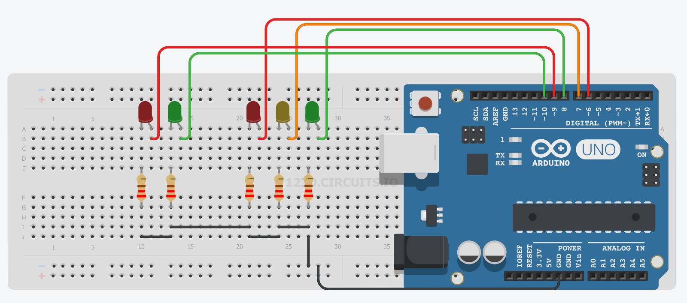

# Proyecto 5: Semáforo para tráfico rodado

Complicamos un poco ahora el [ejemplo anterior](semáforo_v.md), incluyendo dos ledes que simularán el comportamiento de las luces para peatones.

Lógicamente, la luz verde de los peatones deberá estar encendida únicamente cuando lo esté la roja de vehículos. En los otros casos (es decir, con luz ámbar o con luz verde de vehículos), estará encendida la luz roja de peatones.

## [Montaje en Tinkercad](https://www.tinkercad.com/things/fR6lnue0BaZ)

## [Visualiza el código Arduino](semaforo_vp/semaforo_vp.ino)

## Mira cómo funciona

## RETO
## ¿Te atraves a regular un cruce con dos semáforos para vehículos y peatones?