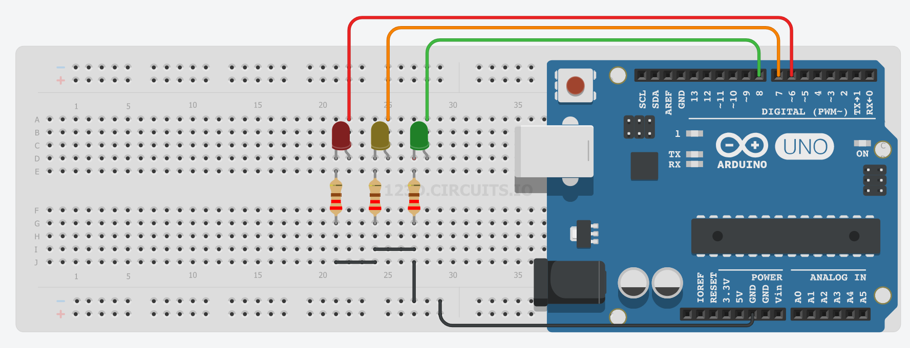

# Proyecto 4: Semáforo para tráfico rodado

El objetivo de este proyecto es simular un semáforo para el control del tráfico de vehículos. Tenemos tres luces, cuya secuencia es la siguiente:
1. Luz roja: 6 segundos de duración.
2. Luz verde: 3 segundos de duración.
3. Luz ámbar: 1 segundo de duración.

El ciclo completo dura, pues, 10 segundos.

## [Montaje en Tinkercad](https://www.tinkercad.com/things/jwSI7gIUxyI)

## [Visualiza el código Arduino](semaforo_v/semaforo_v.ino)

## Mira cómo funciona

