# EJEMPLOS DE CIRCUITOS ANALÓGICOS

Estos circuitos están simulados en Crocodile Technology. Puedes descargarlos y experimentar con ellos tanto como quieras. Sube y baja valores, cambia cables de sitio y, sobre todo, diviértete.
Puedes **descargar Crocodile Technology** desde [este enlace](https://github.com/angelmicelti/TecnoVilladiego4/raw/master/ElecAnalogica/software/Cocodrile%20Technology%206.07%5BPortable%5D.zip).

## 1.DIVISOR DE TENSIÓN
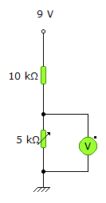
[divisor_tension.cxt](divisor_tension.cxt)

- - -
## 2.DIVISOR DE TENSIÓN CON POTENCIÓMETRO
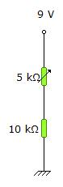
[dt_potenciometro.cxt](dt_potenciometro.cxt)

- - -
## 3.DIVISOR DE TENSIÓN CON LDR

[dt_ldr.cxt](dt_ldr.cxt)

- - -
## 4.DIVISOR DE TENSIÓN CON NTC
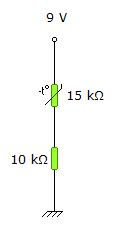
[dt_ntc.cxt](dt_ntc.cxt)

- - -
## 5.DIODO EN POLARIZACIÓN DIRECTA
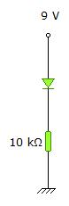
[diodoPD.cxt](diodoPD.cxt)

- - -
## 6.DIODO EN POLARIZACIÓN INVERSA
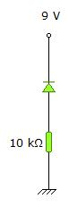
[diodoPI.cxt](diodoPI.cxt)

- - -
## 7.LED EN POLARIZACIÓN DIRECTA
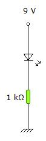
[LEDPD.cxt](LEDPD.cxt)

- - -
## 8.RECTIFICADOR POR PUENTE DE DIODOS
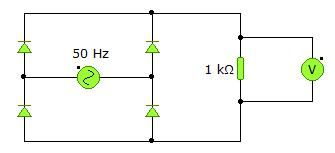
[rectificador_puente.cxt](rectificador_puente.cxt)

- - -
## 9.DETECTOR DE LUZ
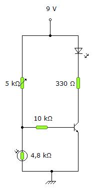
[detector_luz.cxt](detector_luz.cxt)

- - -
## 10.VENTILADOR ACTIVADO POR NTC
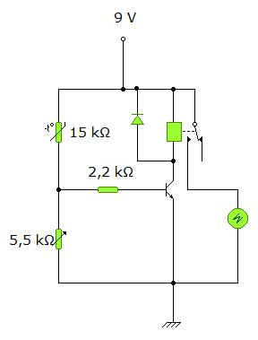
[ventilador_NTC.cxt](ventilador_NTC.cxt)

- - -
## 11.PAR DARLINGTON
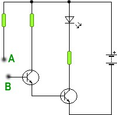

- - -
## 12.MULTIVIBRADOR ASTABLE
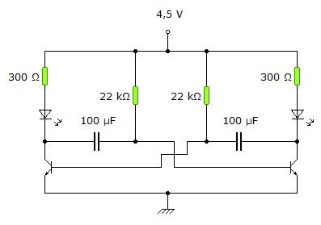
[mv_astable.cxt](mv_astable.cxt)

- - -
## 13.POLARIZACIÓN DE TRANSISTOR POR DIVISOR DE TENSIÓN
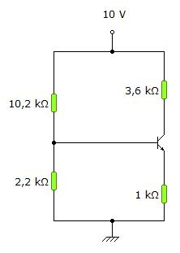
[polarizacionDT.cxt](polarizacionDT.cxt)

- - -
## 14.TEMPORIZADOR CON CONDENSADOR
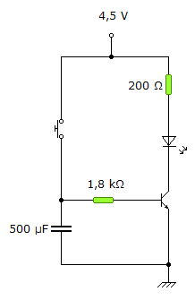
[temporizador.cxt](temporizador.cxt)

- - -

