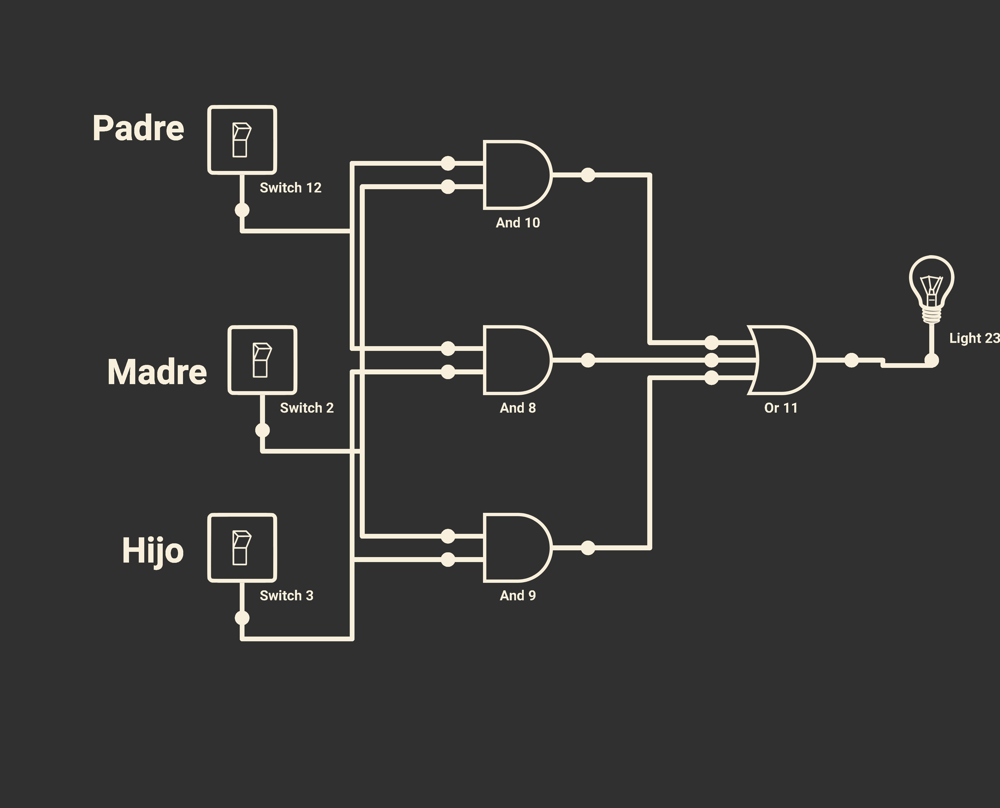

# APLICACIONES DE MÓVIL PARA HACER ELECTRÓNICA DIGITAL

## Smart Logic Simulator Pro

### Ejemplo de circuito del problema 10.4 creado con este simulador

. 

Prueba [este archivo](https://github.com/angelmicelti/TecnoVilladiego4/raw/master/EDI/Apps/Problema10.4.txt) directamente en el simulador.
