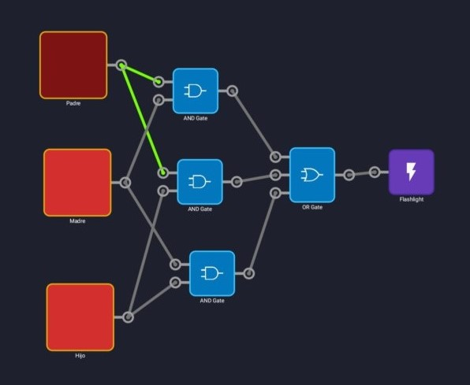

# APLICACIONES DE MÓVIL PARA HACER ELECTRÓNICA DIGITAL

## Logic Circuit Sim Pro

Podemos encontrar esta aplicación en [este enlace](https://play.google.com/store/apps/details?id=com.duracodefactory.logiccircuitsimulatorpro)

### Ejemplo de circuito del problema 10.4 creado con este simulador

. 

Prueba [este archivo](https://github.com/angelmicelti/TecnoVilladiego4/raw/master/EDI/Apps/Problema104.txt) directamente en el simulador.

## Smart Logic Simulator

Podemos encontrar esta aplicación en [este enlace](https://play.google.com/store/apps/details?id=com.tomaszczart.smartlogicsimulator).

### Ejemplo de circuito del problema 10.4 creado con esta aplicación

. 

Prueba [este archivo](https://github.com/angelmicelti/TecnoVilladiego4/raw/master/EDI/Apps/Problema104.slj) directamente en el simulador.

