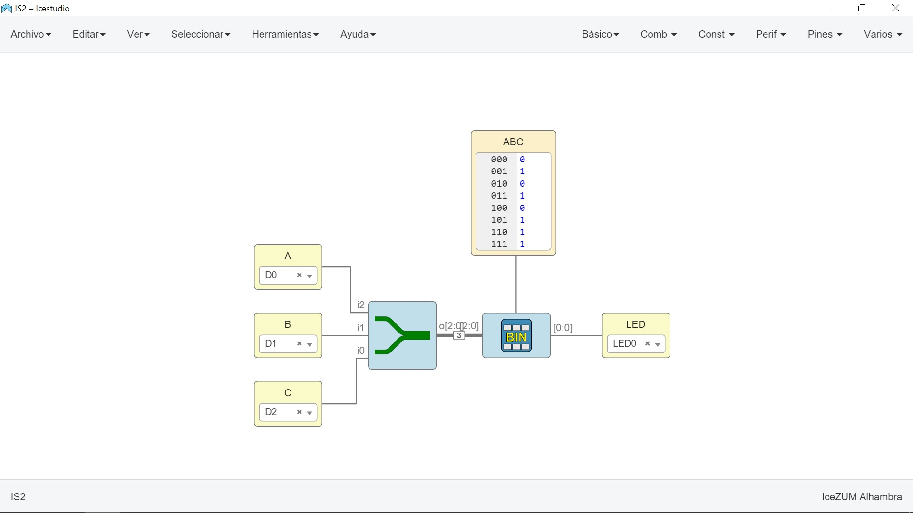
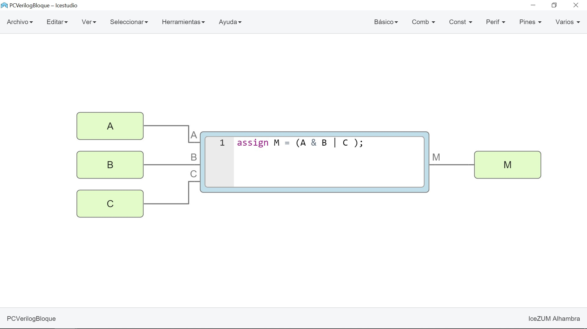
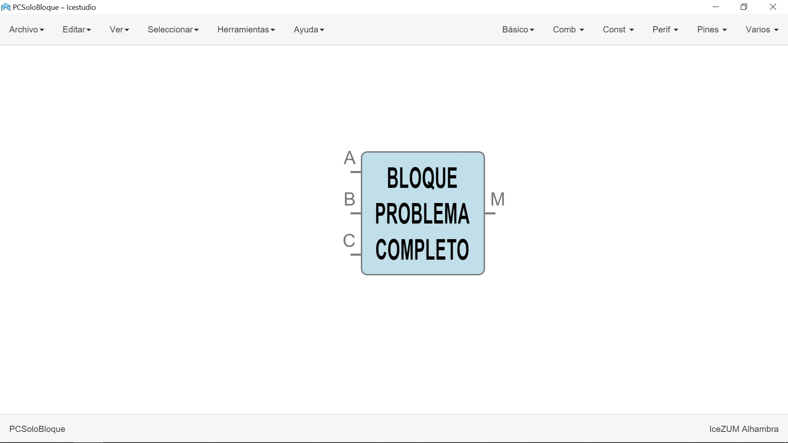

# Resolución de un problema completo de Electrónica Digital

## ENUNCIADO DEL PROBLEMA
**Cierta máquina disponible en el aula de Tecnología tiene tres interruptores (A, B y C) para su puesta en marcha, la cual se producirá al cumplirse estas condiciones: A y B tienen que activarse conjuntamente para que la máquina funcione. Basta que el interruptor C esté activado para que la máquina también funcione, independientemente del estado de A y B.**

## PASOS QUE VAMOS A SEGUIR **SIEMPRE**:
1. [Identificación de las variables y la(s) función(es) lógica(s)](#Punto1)
2. [Tabla de verdad del sistema](#Punto2)
3. [Función lógica con minitérminos y maxitérminos](#Punto3)
4. [Implementación de la función sin simplificar SOP](#Punto4)
5. [Implementación de la función sin simplificar POS](#Punto5)
6. [Simplificación por el método de los diagramas de Karnaugh](#Punto6)
7. [Implementación con puertas lógicas cualesquiera](#Punto7)
8. [Implementación sólo con puertas NAND](#Punto8)
9. [Implementación sólo con puertas NOR](#Punto9)
10. [Montajes prácticos](#Punto10)

     a. [Con puertas cualesquiera](#Punto10a)

     b. [Sólo con puertas NAND](#Punto10b)

     c. [Sólo con puertas NOR](#Punto10c)

11. [Trabajando en FPGA](#Punto11)

     a. [Implementación del problema con puertas lógicas](#Punto11a)

     b. [Implementación del problema con una tabla](#Punto11b)

     c. [Implementación del problema en Verilog](#Punto11c)

## 1. Identificación de las variables y la función lógica

Si recordamos, las **variables binarias** son aquéllas que pueden tomar únicamente dos valores: 0 y 1, apagado y encendido, desconectado y conectado, bajo y alto, etc., y sólo dependen de ellas mismas.
Así pues, parece claro que los interruptores A, B y C serán nuestras variables lógicas. Por tanto, tenemos un problema de **tres variables lógicas**.
En cambio, el estado de la máquina (que podemos llamar, por ejemplo, M para abreviar) que también es binario (la máquina puede estar activada o desactivada) no es una variable lógica. Como el estado de la máquina depende los valores de A, B y C, diremos que **M es la función lógica**.

[Subir](#top)

---

## 2. Tabla de verdad del sistema

Para obtener la tabla de verdad, tenemos que tener en cuenta que:
- Habrá **una columna por cada variable** y **otra para la función**. Como hay tres variables, tendremos un total de cuatro columnas. Por cierto, llamaré "n" al número de variables. Entonces, n=3.

- Habrá **2n** filas (aparte del encabezado de la tabla, lógicamente). Como n = 3, habrá 23 = 8 filas.
Una vez dibujada la tabla, la rellenamos con las combinaciones binarias de A, B y C, dispuestas en orden creciente.
A mí me gusta añadir una columna a la izquierda, indicando el equivalente decimal de la combinación binaria de A, B y C. Quedaría así:

Dec  | A  | B  | C  | M
--|---|---|---|--
0 | 0  | 0  | 0  | 0
1  | 0  | 0  | 0  | 1
2  | 0  | 0  | 1  | 0
3  | 0  | 0  | 1  | 1
4  | 0  | 1  | 0  | 0
5  | 0  | 1  | 0  | 1
6  | 0  | 1  | 1  | 1
7  | 0  | 1  | 1  | 1

[Subir](#top)

---

## 3. Funciones lógicas con minterms y maxterms

**Primera forma canónica o Expresión SOP (Sum Of Products)**
Esta expresión se compone de los llamados [minitérminos](https://angelmicelti.github.io/4ESO/EDI/apndice_i_primera_y_segunda_formas_cannicas.html#minterm). Se obtiene como se explica en [este enlace](https://angelmicelti.github.io/4ESO/EDI/apndice_i_primera_y_segunda_formas_cannicas.html#PFC).

Para nuestra función, quedará:

O bien: M = Σ(1,3,5,6,7)

**Segunda forma canónica o Expresión POS (Product Of Sums)**

Esta expresión se compone de los llamados [maxitérminos](https://angelmicelti.github.io/4ESO/EDI/apndice_i_primera_y_segunda_formas_cannicas.html#maxterm). Se obtiene como se explica en [este enlace](https://angelmicelti.github.io/4ESO/EDI/apndice_i_primera_y_segunda_formas_cannicas.html#SFC).

---

O bien: M = Π(0,2,4)

Observa que _**los índices de los maxitérminos son los complementarios de los minterms**_ (apartado anterior).

[Subir](#top)

---

## 4. Implementación de la función sin simplificar SOP.

**Implementar** una función lógica es el procedimiento mediante el cual transformamos dicha función en una combinación de puertas lógicas que tienen el mismo comportamiento que la función.

A continuación tenemos la implementación en [Digital](https://github.com/hneemann/Digital) de la expresión SOP.

En este gráfico lo hemos implementado con la herramienta "túnel" de Digital:

[Subir](#top)

---

## 5. Implementación de la función sin simplificar POS

A continuación tenemos la implementación en [Digital](https://github.com/hneemann/Digital) de la expresión POS.

En este gráfico lo hemos implementado con la herramienta "túnel":

[Subir](#top)

...

## 6. Simplificación por el método de los diagramas de Karnaugh

Cuando tenemos una función booleana dada por su tabla de verdad, conviene **simplifcarla** para utilizar el  menor número de puertas lógicas posibles (ya sabes, menos puertas = menos "pasta"). Ello abaratará los costes de diseño y de fabricación.

En [este enlace](https://angelmicelti.github.io/4ESO/EDI/apndice_ii_mtodo_de_karnaugh_de_simplificacin_de_funciones_lgicas.html) podemos ver cómo se realiza la simplificación utilizando el método de los diagramas de Karnaugh.

Aplicando este método para nuestro problema, encontramos lo siguiente:

Y, a partir de esto, podemos escribir que:

<h3 align="center">F = A·B +C
</h3>

que es la expresión simplificada de nuestra función.

[Subir](#top)

---

## 7. Implementación con puertas lógicas cualesquiera

En el siguiente montaje hemos utilizado la herramienta "túnel" de Digital para reproducir el mismo circuito.

[Subir](#top)

...

## 8. Implementación sólo con puertas NAND

En el siguiente circuito podemos ver la implementación de la función lógica sólo con puertas NAND.

En el siguiente montaje hemos utilizado la herramienta "túnel" de Digital para reproducir el mismo circuito.

[Subir](#top)

---

## 9. Implementación sólo con puertas NOR

En el siguiente circuito podemos ver la implementación de la función lógica sólo con puertas NOR.

En el siguiente montaje hemos utilizado la herramienta "túnel" de Digital para reproducir el mismo circuito.

[Subir](#top)

---

## 10. Montaje práctico

En este apartado vamos a utilizar dos herramientas:
- [Simulador de circuitos digitales](https://mega.nz/#!zEMEUChA!100b1kDn7GI930JEeH__Y3JHLRVv-yUO9_sGDQHCiOY). Esta herramienta es portable: la puedes descargar a tu PC y montar los circuitos y guardarlos localmente.
- [TinkerCAD](https://www.tinkercad.com). Ésta es una herramienta on-line. Todos los circuitos que montes en ella quedan almacenados en tu cuenta, y disponibles allá donde tengas conexión a Internet.

  ### a. Con puertas cualesquiera

_*Montaje en el simulador de circuitos digitales*_

[Descárgalo y simúlalo en tu PC](PCCV097Cualesquiera.txt)

_*Montaje en TinkerCAD.*_
  

[https://www.tinkercad.com/things/efJZV0doPbd](https://www.tinkercad.com/things/efJZV0doPbd)

---

  ### b. Sólo con puertas NAND

_*Montaje en el simulador de circuitos digitales*_
  

[Descárgalo y simúlalo en tu PC](PCCV097SoloNAND.txt)

_*Montaje en TinkerCAD.*_
  

  [https://www.tinkercad.com/things/kFgOo3q2Dbr](https://www.tinkercad.com/things/kFgOo3q2Dbr)

---

  ### c. Sólo con puertas NOR

_*Montaje en el simulador de circuitos digitales*_
  

  [Descárgalo y simúlalo en tu PC](PCCV097SoloNOR.txt)

_*Montaje en TinkerCAD.*_
  

[  https://www.tinkercad.com/things/0rTmQ8AvSLg](https://www.tinkercad.com/things/0rTmQ8AvSLg)

[Subir](#top)

---

## 11. Trabajando en FPGA

  ### a. Implementación del problema con puertas lógicas

  Una vez dominadas las expresiones vistas anteriormente, es fácil implementar en IceStudio el circuito correspondiente a nuestro problema.

  

  ---

  ### b. Implementación del problema con una tabla

  Podemos implementar nuestro problema también con una tabla de verdad en IceStudio.

  

---

  ### c. Implementación del problema en Verilog

  Como remate de nuestras técnicas de aprendizaje, podemos utilizar Verilog.

  Verilog es un lenguaje de descripción de hardware, es decir, lo que "programamos" es hardware, componentes físicos, que tienen existencia real.

  Con IceStudio podemos crear un **bloque** que tenga las propiedades que resuelven nuestro problema, a saber:
  - Tres entradas: A, B y C.
  - Una salida, a la que llamaremos M.
  - Un elemento, que contendrá la programación en Verilog.

Podemos ver cómo queda en esta imagen:

  

Podemos abrir el bloque en IceStudio, y nos quedará con la siguiente "pinta":

  

  Sólo faltaría añadir las entradas A, B y C, así como la salida, M. Posteriormente, compilamos y subimos el circuito a la placa Alhambra (IceZum o II, da igual), e inmediatamente lo veremos funcionando. ¡Es genial!

  

  Fíjate que, aquí, hemos conectado las entradas A, B y C a los puertos D0, D1 y D2 (respectivamente).
  Así mismo, la salida la hemos conectado al LED 0 de la placa, para visualizar su accionamiento.

  [Subir](#top)
