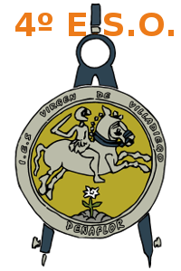
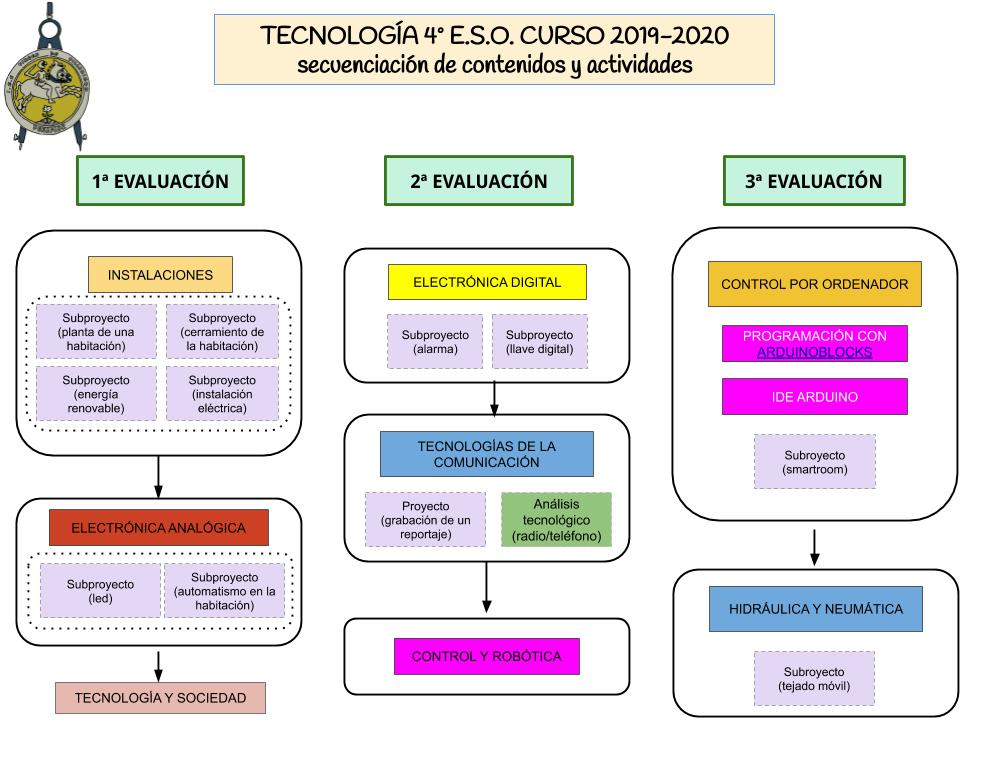

<h1 align="center"> TecnoVilladiego4 </h1>

<h4 align="center"> Repositorio para el alumnado de Tecnología de 4º de E.S.O.
del IES Virgen de Villadiego,

de Peñaflor, Sevilla

</h4>

# [Bloque 1: Tecnologías de la Información y la Comunicación](Telecos/readme.md)

<h3 align="center">

[Do It Yourself (DIY)](DIY/readme.md)

</h3>

---

# [Bloque 2: Instalaciones en Viviendas](INS/readme.md)

---

# Bloque 3: Electrónica

<h3 align="center">

[Electrónica analógica](EAN/readme.md)

[Electrónica digital](EDI/readme.md)

</h3>

---

# [Bloque 4: Control y robótica](CYR/readme.md)

<h3 align="center">

[Arduino](ARD/readme.md)

[TrainerBot](ARD/TrainerBot/readme.md)

</h3>

---

# [Bloque 5: Neumática e Hidráulica](HYN/readme.md)

---

# [Bloque 6: Tecnología y Sociedad](TYS/readme.md)

---

<h2 align="center">

 [PROYECTOS](PROY/readme.md)

</h2>

---

